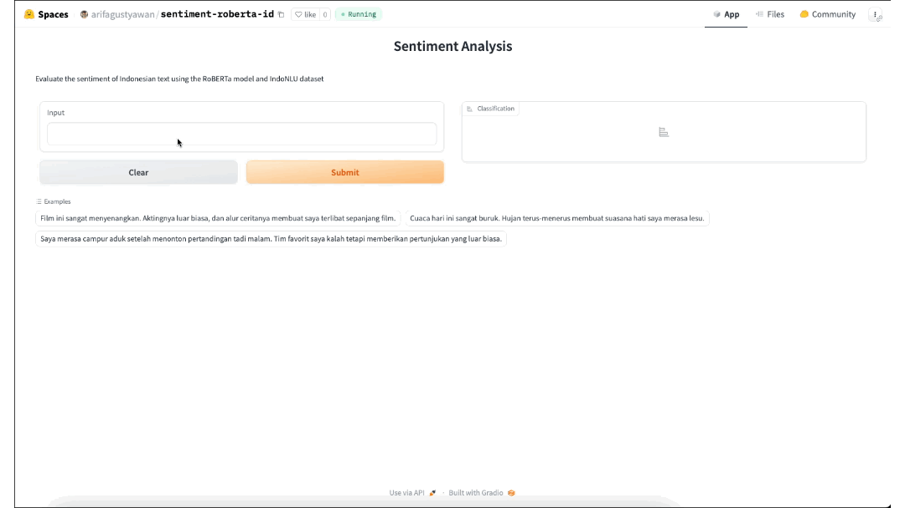
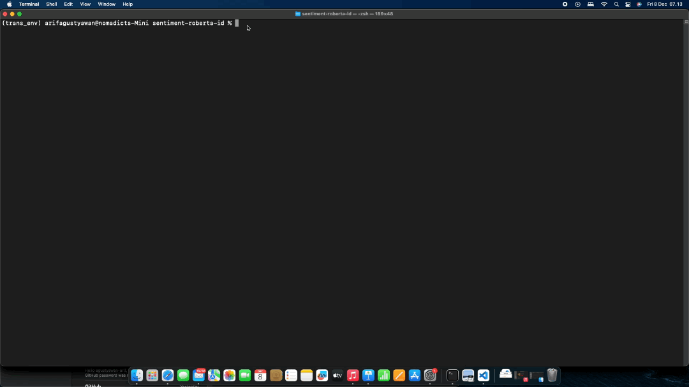

# Sentiment Analysis with RoBERTa Models

This repository contains code for training a sentiment analysis model using the Indonesian RoBERTa base model. The sentiment analysis is performed on an SmSA dataset obtained from the IndoNLU datasets.



[](https://huggingface.co/arifagustyawan/sentiment-roberta-id)
[](https://huggingface.co/spaces/arifagustyawan/sentiment-roberta-id)

## Setup

1. Clone the repository:

   ```bash
   git clone https://github.com/agustyawan-arif/sentiment-roberta-id.git
   cd sentiment-roberta-id
   ```

2. Install dependencies:

   ```bash
   pip install -r requirements.txt
   ```

## Inference

After training, you can use the trained model for sentiment analysis with the inference script. Run the script as follows:

```bash
python inference.py
```

This script allows you to interactively enter text for sentiment analysis, providing the predicted sentiment label and confidence score. Change `model_name` in line 22 to your model name if you have trained your own model



## Configuration

The training and model configuration are specified in the `config.conf` file. Modify this file to adjust training parameters, output directories, and other settings.

## Training

Run the training script to train the sentiment analysis model:

```bash
python src/trainer.py
```

The script uses the specified configuration file (`config.conf`) for training parameters.

## Acknowledgments
- [Hugging Face Model Cards](https://huggingface.co/arifagustyawan/sentiment-roberta-id)
- [Hugging Face Space](https://huggingface.co/spaces/arifagustyawan/sentiment-roberta-id)
- [Hugging Face Transformers](https://github.com/huggingface/transformers)
- [IndoNLU Datasets](https://huggingface.co/datasets/indonlp/indonlu)